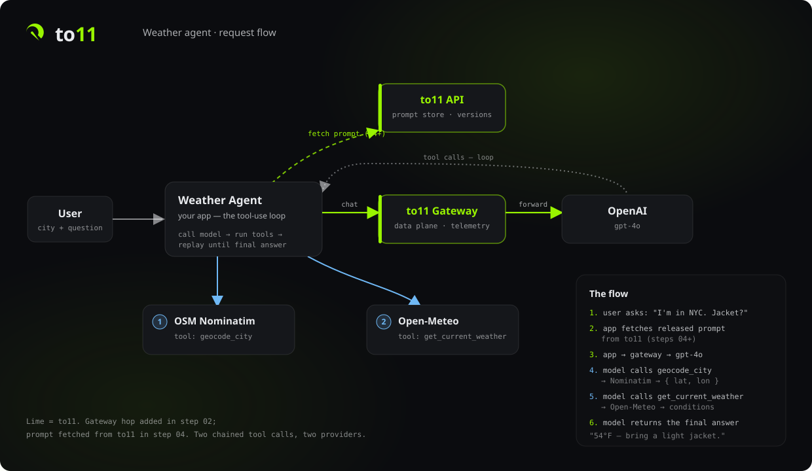
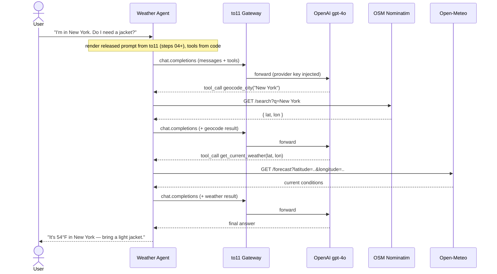

# Weather Agent — a to11 tutorial

Build a tool-using weather agent, then adopt the [to11](https://github.com/to11ai/platform)
platform one layer at a time. The agent takes a city and a question ("I'm in New York.
Do I need a jacket?"), geocodes the city, looks up the current weather, and answers through
an OpenAI `gpt-4o` tool-use loop. The tool definitions live in application code; from step 04
the prompt is managed in to11 (but still carries no tools). Each step lives in its own
directory and is a complete, runnable snapshot — so a `diff` between two steps shows you
exactly what that step adds.

## How it works

<p align="center">
  
</p>

The runtime sequence, including the two chained tool calls (the to11 gateway hop appears
from step 02 on; in step 01 the app calls OpenAI directly):



## What you'll build

Five steps, each adding exactly one layer:

| Step | Directory | Adds |
|------|-----------|------|
| 1 | [steps/01-vanilla](steps/01-vanilla) | The agent with no to11 — prompt + tools in code |
| 2 | [steps/02-gateway](steps/02-gateway) | Route through the to11 gateway for observability |
| 3 | [steps/03-connect-provider](steps/03-connect-provider) | Connect OpenAI in to11; drop the provider key |
| 4 | [steps/04-fetch-prompt](steps/04-fetch-prompt) | Author the prompt in to11; the app renders it |
| 5 | [steps/05-label-deploy](steps/05-label-deploy) | Versions, staging/prod labels, provenance, rollback |

## Prerequisites

- **[Bun](https://bun.sh) 1.3+** — the runtime and package manager (Bun runs TypeScript
  directly and auto-loads `.env`, so there's no build step).
- An **OpenAI API key** (used directly in step 01; routed through to11 from step 02).
- From **step 02 on**, a **to11 account** with an API key and a project id.

### to11 endpoints

Steps 02+ use **hosted to11** through the `@to11ai/sdk` (`createClient`), which reads these
from the environment. The URLs default to hosted to11, so you only set them to self-host;
each step's `.env.example` lists the vars it needs:

| Variable | Purpose | Default |
|----------|---------|---------|
| `TO11_GATEWAY_URL` | Data plane — the gateway **host** (the SDK adds the `/v1` path) | `https://gw.to11.ai` |
| `TO11_API_URL` | Control plane — prompt/config API host (steps 04+) | `https://api.to11.ai` |
| `TO11_ENV` | Serving environment label (read by the SDK) | `prod` (from `.env.example`; no SDK default) |

> `TO11_GATEWAY_URL` (data plane) and `TO11_API_URL` (control plane) are **different
> services** — don't point one at the other. Both are **host only** (no `/v1`); the SDK
> adds the path each client expects.

## Run any step

```bash
cd steps/01-vanilla
bun install
cp .env.example .env   # fill in your keys
bun start
```

Start with [steps/01-vanilla](steps/01-vanilla) and work upward — each step's README ends
with what changed and what comes next.
